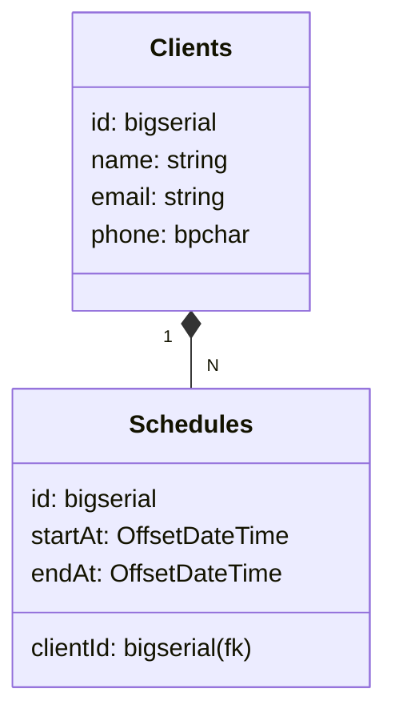

# Barber Shop API

## Visão Geral

Esta API REST foi desenvolvida para fornecer funcionalidades completas para uma barbearia moderna, permitindo o gerenciamento de clientes e agendamentos.

## Principais Tecnologias
- **Java 21**
- **Spring Boot 3.4.3**
- **Spring Data JPA**
- **Spring Web**
- **PostgreSQL**
- **Flyway**
- **Docker**

## Funcionalidades Principais

* **Gerenciamento de Clientes:** Crie, atualize, exclua clientes e vizualize todos os clientes.
* **Agendamentos:** Agende, remarque ou cancele serviços para seus clientes.

## Endpoints

Abaixo estão os endpoints disponíveis na API:  
Mais informações acesse a documentação da [**Barber Shop API**](https://documenter.getpostman.com/view/25826614/2sAYkGKeYU).

### Clientes

* `GET /clients`: Lista todos os clientes.
* `GET /clients/{id}`: Retorna um cliente específico pelo ID.
* `POST /clients`: Cria um novo cliente.
* `PUT /clients/{id}`: Atualiza um cliente existente.
* `DELETE /clients/{id}`: Exclui um cliente.

### Agendamentos

* `GET /schedules/{year}/{month}`: Lista todos os agendamentos de determinado mês e ano.
* `POST /schedules`: Cria um novo agendamento.
* `DELETE /schedules/{id}`: Exclui um agendamento.

## Diagrama de Classes (Domínio da API)

